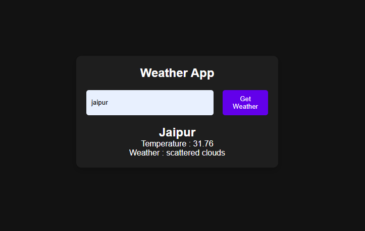

# JavaScript Weather App

This is a clean and modern weather application built with vanilla JavaScript, HTML, and CSS. The app fetches and displays real-time weather data from a live API based on a user's city search. This project demonstrates the ability to work with external APIs, handle asynchronous JavaScript, and dynamically update the DOM.

## Screenshot



## Features

- **Live Weather Data:** Utilizes the OpenWeatherMap API to fetch up-to-the-minute weather information.
- **Search by City:** Allows users to search for the weather in any city around the world.
- **Dynamic UI:** The interface updates dynamically to display the current temperature, weather conditions (e.g., "Clouds", "Clear"), humidity, and wind speed.
- **Error Handling:** Provides feedback to the user if the entered city cannot be found.
- **Responsive Design:** The layout is fully responsive and provides a great user experience on both desktop and mobile devices.

## Tech Stack

- **JavaScript (Vanilla):**
  - Uses the **Fetch API** to make asynchronous requests to the weather service.
  - Handles JSON data parsing.
  - Manages all DOM manipulation to display the fetched data.
- **HTML5:** Provides the semantic structure for the search input and weather display components.
- **CSS3:** Handles all custom styling, layout, and responsive design.

## Setup

To run this project locally, you need to have your own API key from [OpenWeatherMap](https://openweathermap.org/api).

1.  Clone the repository.
2.  Sign up for a free API key from OpenWeatherMap.
3.  In the `script.js` file, find the placeholder for the API key:
    ```javascript
    const apiKey = "YOUR_API_KEY_HERE";
    ```
4.  Replace `"YOUR_API_KEY_HERE"` with your actual key.
5.  Open `index.html` in your browser.

## Contributing

Contributions are what make the open-source community such an amazing place to learn, inspire, and create. Any contributions you make are **greatly appreciated**.

If you have a suggestion that would make this better, please fork the repo and create a pull request. You can also simply open an issue with the tag "enhancement". Don't forget to give the project a star! Thanks again!

1.  Fork the Project
2.  Create your Feature Branch (`git checkout -b feature/AmazingFeature`)
3.  Commit your Changes (`git commit -m 'Add some AmazingFeature'`)
4.  Push to the Branch (`git push origin feature/AmazingFeature`)
5.  Open a Pull Request
